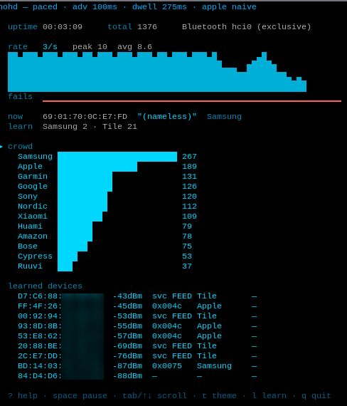

# helmofhades (`hohd`)

A BLE privacy / anti-tracking **decoy** for Linux — a native Go port of the
concept from [JakeSwiz/splinter](https://github.com/JakeSwiz/splinter) (an ESP32
firmware), targeting the **ClockworkPi uConsole (CM4)** and its onboard Bluetooth
radio. No extra hardware required.



*The live `--dashboard` on a ClockworkPi uConsole — a churning decoy crowd, learn
results, and the real devices it sees nearby (addresses partly redacted).*

## What it does

`hohd` continuously fabricates a churning crowd of plausible-but-fake
Bluetooth LE devices. In a space you control, a tracking or scanning system then
sees lots of ordinary-looking traffic, so your real device(s) don't stand out.

Every cycle it retires the current advertisement and mints a new decoy with:

- a fresh **random-static MAC** — the same privacy behavior modern phones,
  watches, and earbuds already use, so the churn looks realistic;
- a random vendor from an independently-curated palette of real **Bluetooth SIG
  company IDs**, surfaced via the manufacturer-specific-data field (the
  spec-defined vendor signal a scanner actually reads);
- an optional short device name and a benign random payload.

A scanner sampling over a few seconds logs dozens of distinct, vendor-attributed
devices appearing and disappearing.

## What it deliberately does NOT do

Advertising is **non-connectable**, and the payload is never shaped like Apple
Continuity (`0x004C`), Microsoft Swift Pair (`0x0006`), or Google Fast Pair
(`0xFE2C`). Those formats pop pairing dialogs on bystanders' phones and PCs — a
decoy needs realistic *presence*, not popup spam aimed at people nearby.

> Intended for privacy/anti-tracking in a space **you control**. Don't point it at
> other people's devices.

## Hardware / platform

Linux with a BlueZ-managed HCI controller. Validated on the ClockworkPi uConsole
(CM4, Cypress **CYW43455**, Bluetooth 5.0, BlueZ 5.82).

**Capability caveat:** the CYW43455 does **not** support LE Extended Advertising
(its LE feature bitmap has bit 12 clear). hohd therefore reproduces the
original firmware's *classic* behavior — **one legacy advertiser rotated fast** —
rather than the ESP32-C5's genuinely-concurrent advertising instances. The
observable "crowd" a scanner sees is equivalent; it's produced by rapid rotation
instead of hardware concurrency.

## Build & deploy

hohd is pure Go (no cgo) and cross-compiles to a static binary. Build on your
Mac/PC and copy the binary to the uConsole — nothing to install on the device.

```bash
make build-uconsole                 # -> dist/hohd-arm64 (static aarch64)
make deploy                         # scp the binary to the device
#   UCONSOLE_HOST=eris@192.168.68.61 make deploy   # override target host
```

Then run it ad-hoc on the device (it needs root for the Bluetooth adapter):

```bash
sudo ~/hohd-arm64 --dashboard       # or any of the flags below
```

(An on-device build via `apt install golang` also works — the module pins `go
1.24` — but cross-compiling is simpler and needs no toolchain on the uConsole.)

## Run

```bash
hohd [flags]
```

| Flag | Default | Meaning |
|------|---------|---------|
| `--rotate-ms` | 250 | paced-mode dwell per identity before rotating (ms) |
| `--adv-ms` | 100 | advertising interval minimum (ms); max = this + 30. Validation floor 20 (BLE); note this controller rejects non-connectable intervals below 100 ms |
| `--name-prob` | 40 | % chance a decoy advertises a name |
| `--mfg-prob` | 90 | % chance a decoy carries vendor manufacturer data |
| `--dense` | false | self-calibrating maximum-visibility mode (probe, then run at the optimal settings) |
| `--aggressive` | false | with `--dense`, allow the lowest advertising interval (more visible, more power) |
| `--adverts-per-id` | 2 | advertising events per identity before rotating (dense dwell = this × adv-ms) |
| `--benchmark` | false | bounded self-calibration: probe intervals, print recommended settings, then exit |
| `--duration` | 10s | `--benchmark` run time |
| `--hci` | 0 | HCI device index to drive (`hciX`) |
| `--dashboard` | false | live mtr-style terminal dashboard instead of line logs (needs a TTY; falls back to logging when piped or non-interactive) |
| `--theme` | matrix | dashboard color theme: `matrix` / `amber` / `neon` / `ocean` / `synthwave` / `gruvbox` / `dracula` / `mono` (honors `NO_COLOR`) |
| `--learn-window` | 15s | learn-mode passive scan window (dashboard `l` key) |
| `--apple-mode` | naive | Apple decoy mode: `off` / `naive` / `nearform` (dashboard `a` cycles live) |
| `--apple-share` | 15 | % of decoys that impersonate Apple when `--apple-mode` ≠ off |
| `--trackers` | false | emit service-data trackers Tile + Fast Pair (dashboard `s` toggles live) |
| `--tracker-share` | 20 | % of decoys that are service-data trackers when `--trackers` is on |
| `--debug` | false | write a debug log of engine activity to a file (dashboard `D` toggles live) |
| `--log-file` | | debug log path (default: a timestamped `hohd-<ts>.log` in the current dir) |
| `--verbose` | false | debug logging |
| `--version` / `--help` | | print and exit |

It needs `CAP_NET_RAW` + `CAP_NET_ADMIN` — run it with `sudo` (or grant the caps
with `setcap`). Once
running it logs `rate: devices_per_sec=N` every second.

### Getting a crowd a scanner actually sees

A decoy is only observable if its identity stays on-air long enough to transmit at
least one advertising packet — i.e. the **dwell (`--rotate-ms`) must be ≥ the
advertising interval (`--adv-ms`)**. Rotating faster than you advertise (the old
"flood") maxes out HCI commands but broadcasts almost nothing; hohd warns if
you configure `--rotate-ms < --adv-ms`.

The easy path is **`--dense`**, which probes the controller for ~10 s to find the
fastest advertising interval it actually sustains, then runs at the
visibility-optimal `rotate-ms = --adverts-per-id × adv-ms`:

```bash
sudo hohd --dense              # calm default
sudo hohd --dense --aggressive # push to the lowest interval the radio allows
hohd --benchmark               # just probe + print the recommended flags, don't run
```

Add **`--dashboard`** to any run mode for a live, in-place-refreshing terminal view
(counters, rate/fails sparklines, the current fake identity, and a vendor-crowd
histogram) instead of scrolling log lines — think `mtr`. It needs an interactive
terminal; when stdout isn't a TTY (piped or non-interactive) it automatically falls
back to line logging.

The dashboard shows a **multi-row rate graph**, a compact fails sparkline, the
current fake identity, and an **htop-style vendor "crowd" table** (name · bar ·
count). **Hotkeys**: `+`/`-` raise/lower the live rate (clamped to the visibility
floor), `t` cycles the color theme, `l` runs **learn mode**, `a` cycles **Apple
mode**, `s` toggles **service-data trackers**, `Space` **stops/starts**
broadcasting, `Tab` switches which table has scroll focus, `↑`/`↓`/`PgUp`/`PgDn`/
`Home`/`End` (or `j`/`k`/`g`/`G`) scroll it, `D` toggles a **debug log file**,
`?` shows the full **help overlay**, and `q` (or Ctrl-C) quits. Pick a starting
palette with `--theme` (matrix/amber/neon/ocean/synthwave/gruvbox/dracula/mono).

The dashboard has two scrollable tables: the vendor **crowd** and, after a learn
scan, a **learned-devices** table listing the real devices around you (MAC,
signal strength, and company/service ID). **Space** pauses broadcasting while
keeping the adapter, so you can freeze the display without handing Bluetooth
back. **`D`** (or `--debug` / `--log-file`) writes a timestamped log of engine
activity — decoy mints, rate, learn events — to a `0600` file in the current
directory; it's silent until armed, so it never disturbs the display.

**Learn mode** (`l`): pauses advertising, passively scans nearby BLE for
`--learn-window` (default 15 s), and then **weights the decoys toward the vendor
mix actually around you** (phones, tags, watches, car sensors) so the fakes blend
in. It never replays real devices' addresses/payloads — it just biases which of
its own vendor decoys it mints. Press `l` again to re-scan. Learn also counts the
trackers below and tilts their Tile/Fast-Pair split toward what it sees.

**Apple impersonation** (`--apple-mode`, hotkey `a`): most real environments are
Apple-heavy, so blending in as an iPhone hides your real Apple devices from a
scanner that buckets by company ID. `naive` (default) emits Apple's `0x004C`
company ID — enough to defeat company-ID bucketing; `nearform` emits a
well-formed Continuity **Nearby Info** beacon, indistinguishable from a real
iPhone to a format-aware fingerprinter; `off` disables it. The `a` hotkey cycles
off → naive → nearby-info. hohd **never** emits Apple Find My (`0x12`)
frames — those would trigger "unknown tracker near you" anti-stalking alerts on
bystanders.

**Service-data trackers** (`--trackers`, hotkey `s`, off by default): Tile
(`0xFEED`) and Google Fast Pair (`0xFE2C`) advertise via service data, not
manufacturer data, so they need their own decoy shape. Fast Pair decoys are
always **non-discoverable** (an account-key-filter frame with the "hide-UI" type)
so they read as Fast Pair traffic to a passive collector but never pop a "tap to
pair" sheet — or any notification — on a bystander's phone.

On the uConsole's **CYW43455**, non-connectable advertising is floored at **100 ms**
(the legacy `ADV_NONCONN_IND` minimum — the chip rejects lower), so `--dense`
calibrates to `adv-ms=100, rotate-ms=200` (~5 visible decoys/sec). Confirm the crowd
with a BLE scanner (nRF Connect) or `hoh-verify` on a second device.

## Bluetooth coexistence

While running, hohd takes **exclusive** control of the adapter — normal
Bluetooth (audio, etc.) is unavailable for the session. It hands the controller
back to `bluetoothd` cleanly on exit (SIGINT/SIGTERM). If
Bluetooth ever misbehaves after an unclean exit, recover with:

```bash
sudo systemctl restart bluetooth
```

## Verifying parity

The `hoh-verify` tool scans from a **second** BLE device and reports the
decoy crowd (distinct MACs/sec, vendor-ID spread) and asserts the guardrails
(no Apple/Microsoft/Fast-Pair payloads, all non-connectable). See
[`docs/verify.md`](docs/verify.md).

## Attribution & license

A native Linux/Go port of the **concept** from
[JakeSwiz/splinter](https://github.com/JakeSwiz/splinter). This is an independent
reimplementation — it does not derive from that project's source, and its vendor
company IDs are sourced independently from the public
[Bluetooth SIG assigned-numbers registry](https://www.bluetooth.com/specifications/assigned-numbers/).

Licensed under **GPLv3** — see [LICENSE](LICENSE).
